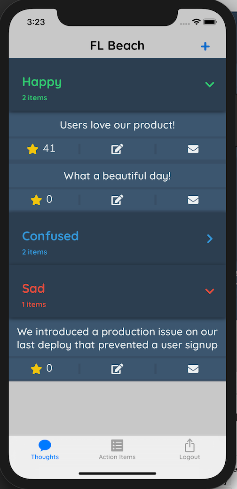

# RetroQuest iOS

### RetroQuest iOS is a native experience for RetroQuest.  

It provides the main functionality you would expect from the RetroQuest website, and also can remember your board credentials securely.
See [the RetroQuest repository](https://github.com/FordLabs/retroquest) for more information about RetroQuest.



## Beta Builds

The app is currently in beta with pre-built binaries limited to Ford employees as we gather feedback.
Microsoft App Center is used for both distribution and crashalytics for beta test users.
If you are a Ford employee and would like to help test, contact a maintainer of this project.

We hope to distribute to the Apple App Store in the future.

## Building

1. You will need these tools installed to develop the app
    * [Xcodegen](https://github.com/yonaskolb/XcodeGen) - ```brew install xcodegen```
    * [Sourcery](https://github.com/krzysztofzablocki/Sourcery) - ```brew install sourcery```
    * [Swiftlint](https://github.com/realm/SwiftLint) - ```brew install swiftlint```
    * [Fastlane](https://fastlane.tools/) - ```brew cask install fastlane```
    * [Xcode 11+ and Xcode command line tools](https://developer.apple.com/download/more/) - download at link
2. Clone this repository
3. Set environment variable, ```RETROQUEST_SERVER_URL```, to tell the app where the RetroQuest server is running:
    * Export variable on your machine or
    * Create an ```env-vars.sh``` script at the root of the repository containing: ```export RETROQUEST_SERVER_URL=https://myurl.com/```
4. Run ```xcodegen generate``` in the root of the repository
5. Run ```fastlane tests``` to build and test the app

## License

RetroQuest iOS is licensed under the Apache 2.0 license.
However, please do not ship this app under your own account, paid or free.

## Contributing

We welcome contributions!
Please see our [contributing doc](.github/CONTRIBUTING.md) for information on how to contribute, code standards, etc.
